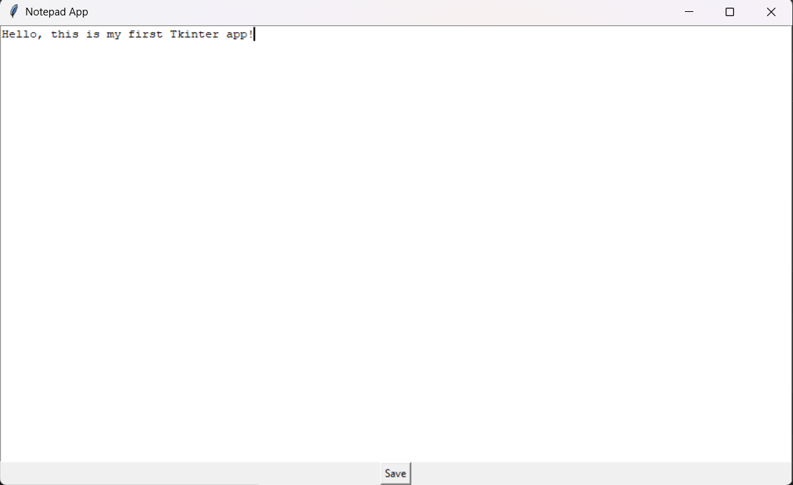
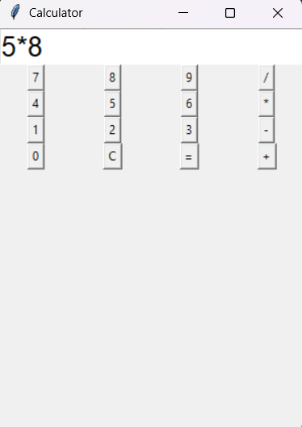
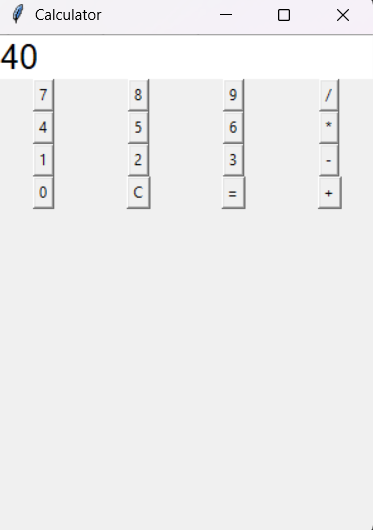

# 🖥️ Tkinter Apps Collection

A collection of beginner-friendly desktop GUI applications built using Python and Tkinter.
This project is part of my journey in learning GUI development and building real-world applications.

---

## 📌 Projects Included

### 📝 Notepad App

A simple text editor to write and save notes.

#### ✨ Features

* Create and edit text
* Save files locally as `.txt`
* Minimal and clean interface

#### 🖼️ Preview



---

### 🧮 Calculator App

A basic calculator for performing arithmetic operations.

#### ✨ Features

* Addition, subtraction, multiplication, division
* Error handling for invalid inputs
* Structured button layout using grid

#### 🖼️ Preview





---

## 🚀 How to Run

1. Clone the repository:

```bash
git clone https://github.com/SamShri16/tkinter-apps.git
```

2. Navigate into the folder:

```bash
cd tkinter-apps
```

3. Run the apps:

### Notepad

```bash
python notepad/notepad.py
```

### Calculator

```bash
python calculator/calculator.py
```

---

## 🛠️ Tech Stack

* Python
* Tkinter

---

## 📈 Future Improvements

* Dark mode UI
* Advanced scientific calculator
* Multiple tabs in notepad
* Improved UI/UX design

---

## 👨‍💻 Author

Samarth Shrivastava

---

⭐ If you like this project, consider giving it a star!
